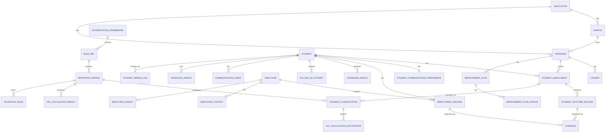

# OutcomeLink Data Model (Draft v1)

This is a first-pass logical data model derived from `OutcomeLink_Project_Specification.md`. It is meant to be argued with, not implemented as-is. Field lists are logical (not final column types); PK/FK conventions assume surrogate integer or UUID keys unless noted.

Every table that participates in accreditation calculations carries `reporting_period_id` explicitly rather than deriving it from a date range at query time (see spec §16).

## 1. Entity groups

- **Org structure**: Institution, Campus, Department, Program, Cohort
- **Identity & access**: User, Role, UserProgramAccess, UserCampusAccess
- **Students**: Student, StudentCommunicationPreference, StudentEnrollment
- **Accreditation engine**: AccreditationFramework, RuleSet, ReportingPeriod, StudentClassification, CplCalculationResult, CplCalculationExplanation, ValidationIssue
- **Outcomes**: StudentOutcomeRecord, EmploymentRecord, LicensureResult
- **Employers**: Employer, EmployerContact
- **Follow-up & verification**: FollowUpAttempt, VerificationRecord, Evidence, CommunicationEvent (timeline)
- **Surveys**: GraduateSurvey, GraduateSurveyResponse, EmployerSurvey, EmployerSurveyResponse
- **Improvement & governance**: ImprovementPlan, ImprovementPlanUpdate, AuditLogEntry, StudentMergeLog
- **Operations**: ImportBatch, ImportMappingProfile, ImportRowError, Notification

## 2. Org structure

**Institution**
- id (PK)
- name
- created_at

**Campus**
- id (PK)
- institution_id (FK -> Institution)
- name
- address fields

**Department** (optional)
- id (PK)
- institution_id (FK)
- name

**Program**
- id (PK)
- institution_id (FK)
- campus_id (FK -> Campus)
- department_id (FK -> Department, nullable)
- name, code, cip_code
- credential_type
- program_length, clock_hours, credit_hours
- licensure_required (bool)
- accreditation_reporting_status
- active, effective_start_date, effective_end_date

**Cohort** (optional)
- id (PK)
- program_id (FK)
- name, entry_term, entry_year

## 3. Identity & access

**User**
- id (PK)
- institution_id (FK)
- name, email, password_hash
- role_id (FK -> Role) — or many-to-many if a user can hold multiple roles
- active, last_login_at

**Role** (enum-backed lookup: System Administrator, Institutional Administrator, Program Administrator, Career Services / Placement Staff, Instructor/Staff, Read-Only/Auditor)

**UserProgramAccess** — many-to-many User <-> Program, for program-scoped roles
**UserCampusAccess** — many-to-many User <-> Campus, for campus-scoped roles

## 4. Students

**Student**
- id (PK)
- institution_id (FK)
- internal_student_id
- first_name, last_name, preferred_name
- email, phone
- created_at

**StudentCommunicationPreference**
- id (PK)
- student_id (FK, 1:1)
- preferred_contact_method
- sms_consent_status, sms_consent_date
- do_not_contact (bool), do_not_contact_reason

**StudentEnrollment**
- id (PK)
- student_id (FK)
- program_id (FK)
- campus_id (FK)
- cohort_id (FK, nullable)
- start_date, expected_completion_date, actual_completion_date
- enrollment_status (Active, Graduate Completer, Non-Graduate Completer, Withdrawn, Transferred, Other — display status only)
- credential_earned, exit_reason

A student may have more than one `StudentEnrollment` over time (re-enrollment in a different program). Accreditation classification is never derived from `enrollment_status` directly — that's the rules engine's job, driven off `StudentEnrollment` + `StudentOutcomeRecord` data (spec §3, §6).

## 5. Accreditation engine

**AccreditationFramework**
- id (PK)
- name (e.g., "COE")
- description

**RuleSet**
- id (PK)
- framework_id (FK)
- version_label (e.g., "COE-2026")
- effective_start_date, effective_end_date
- rule_definition (structured config: classification rules, numerator/denominator rules, exclusions, benchmarks — see §6 below)

**ReportingPeriod**
- id (PK)
- institution_id (FK)
- rule_set_id (FK -> RuleSet) — pins the rule version for this period, per spec §16/§18
- label, start_date, end_date
- cohort_window_definition (how completion dates map into this period)
- status (Open, Ready for Review, Finalized, Submitted, Reopened)
- finalized_at, finalized_by, reopened_at, reopened_by, reopen_reason

**StudentClassification**
- id (PK)
- student_enrollment_id (FK)
- reporting_period_id (FK)
- classification_code (rule-set-controlled value, e.g., Graduate Completer / Non-Completer / Exclusion category)
- determined_by_rule_set_id (FK) — should match the reporting period's rule set, but stored explicitly for traceability if a period is reopened under a later rule set
- computed_at

**CplCalculationResult**
- id (PK)
- program_id (FK, nullable for institution-level rollups)
- reporting_period_id (FK)
- metric (Completion | Placement | Licensure)
- numerator, denominator, percentage
- computed_at

**CplCalculationExplanation** — backs the "How This Student Counts" panel (spec §19)
- id (PK)
- student_classification_id (FK)
- metric (Completion | Placement | Licensure)
- counts_in_numerator (bool), counts_in_denominator (bool)
- reason_text (generated by the calculation engine, not hand-written)

**ValidationIssue**
- id (PK)
- reporting_period_id (FK)
- student_id (FK, nullable — some issues are program- or period-level, e.g. "enrollment totals do not reconcile")
- program_id (FK, nullable)
- issue_type (missing classification, missing completion date, employment without employer, etc. — spec §22)
- severity (ERROR | WARNING | INFORMATION)
- detected_at, resolved_at, resolved_by

## 6. Outcomes

**StudentOutcomeRecord**
- id (PK)
- student_enrollment_id (FK)
- reporting_period_id (FK)
- completion_classification
- employment_status
- employer_id (FK, nullable)
- job_title, employment_start_date
- related_to_training (bool), related_to_training_justification
- continuing_education_status
- military_status (nullable)
- availability_for_employment_status
- licensure_required (bool)
- verification_status, verification_method, verified_by, verification_date
- notes

**EmploymentRecord** — historical, not overwritten (spec §8)
- id (PK)
- student_id (FK)
- employer_id (FK)
- job_title
- start_date, end_date (nullable)
- full_time (bool)
- related_to_training (bool), relationship_determination_method
- salary_or_wage (nullable, voluntary)
- employment_status
- verification_status, verification_date, verification_source
- notes

**LicensureResult**
- id (PK)
- student_id (FK)
- program_id (FK)
- exam_name
- scheduled_date, exam_date
- result (Passed | Failed | Unknown | Waiting | Scheduled)
- attempt_number (supports first-attempt pass rate)

## 7. Employers

**Employer**
- id (PK)
- institution_id (FK)
- name, industry, naics_code
- address, city, state, zip, website
- notes, active

**EmployerContact**
- id (PK)
- employer_id (FK)
- name, title, phone, email
- is_primary_contact (bool), is_verification_contact (bool)

Employer profile aggregates (hire counts, time-to-employment, survey results) are computed views over `EmploymentRecord` / `EmployerSurveyResponse`, not stored fields — avoids duplicate-source-of-truth drift.

## 8. Follow-up, verification, evidence

**FollowUpAttempt**
- id (PK)
- student_id (FK)
- staff_user_id (FK -> User)
- attempted_at
- method (Phone, Email, SMS, Survey, In person, Employer contact, Other)
- outcome (No response, Student contacted, Employment reported, ... — spec §11)
- notes, next_follow_up_date

**VerificationRecord**
- id (PK)
- outcome_record_id (FK, nullable) or employment_record_id (FK, nullable) — polymorphic target
- verification_method, verified_by, verification_date, verification_status

**Evidence**
- id (PK)
- outcome_record_id (FK, nullable) or employment_record_id (FK, nullable) or licensure_result_id (FK, nullable)
- evidence_type (employer verification, graduate confirmation, email, letter, survey, employment documentation, licensure result, school record, other)
- file_reference, description
- uploaded_by, uploaded_at
- verification_status

**CommunicationEvent** — denormalized append-only feed backing the Unified Student Communication Timeline (spec §47)
- id (PK)
- student_id (FK)
- event_type (follow_up_attempt | survey_sent | survey_response | verification_contact | notification)
- source_id (id of the underlying FollowUpAttempt / Survey record / etc.)
- occurred_at
- summary_text

## 9. Surveys

**GraduateSurvey** / **GraduateSurveyResponse**
- survey: id, student_id, sent_at, channel
- response: id, survey_id (FK), employment_status, employer, job_title, related_to_training_response, continuing_education, satisfaction_rating, skills_preparedness_rating, comments, submitted_at

**EmployerSurvey** / **EmployerSurveyResponse**
- survey: id, employer_id, student_id (which graduate this concerns), sent_at
- response: id, survey_id (FK), employment_verification, technical_preparedness_rating, communication_rating, problem_solving_rating, professionalism_rating, overall_satisfaction_rating, skills_gap_notes, likelihood_to_hire_again_rating, comments, submitted_at

Survey responses feed `StudentOutcomeRecord` / `EmploymentRecord` only through an explicit review step — they are never auto-promoted to verified accreditation data (spec §43).

## 10. Improvement plans & governance

**ImprovementPlan**
- id (PK)
- program_id (FK)
- metric, reporting_period_id (FK)
- current_result, target
- problem_description, root_cause
- responsible_user_id (FK -> User)
- due_date, status (Draft, Active, Monitoring, Completed, Closed)

**ImprovementPlanUpdate**
- id (PK)
- improvement_plan_id (FK)
- update_text, corrective_action, supporting_evidence_id (FK -> Evidence, nullable)
- created_by, created_at

**AuditLogEntry** — generic, applies across entities (spec §15)
- id (PK)
- entity_type, entity_id
- action (create | update | delete | merge | finalize | reopen)
- field_changed, previous_value, new_value
- user_id (FK), occurred_at, reason

**StudentMergeLog** — specific record of the Duplicate Student Resolution workflow (spec §23)
- id (PK)
- surviving_student_id (FK), merged_student_id (FK)
- performed_by, performed_at, reason

## 11. Operations

**ImportBatch**
- id (PK)
- source_system, uploaded_by, uploaded_at
- mapping_profile_id (FK -> ImportMappingProfile, nullable)
- status (uploaded, mapped, validated, previewed, imported, failed)

**ImportMappingProfile** — reusable column mapping per source system (spec §51)
- id (PK)
- institution_id (FK), source_system_name
- column_mapping (structured: source column -> target field)

**ImportRowError**
- id (PK)
- import_batch_id (FK)
- row_number, error_message, raw_row_data

**Notification**
- id (PK)
- user_id (FK)
- type (Follow-up due, Follow-up overdue, Verification required, Licensure result required, Validation error, Improvement-plan task due, Program below threshold)
- reference_entity_type, reference_entity_id
- created_at, read_at

## 12. ERD (core relationships)

## 13. Open questions to resolve before implementation

1. **Polymorphic FKs** (`VerificationRecord`, `Evidence`) — decide between nullable multi-FK columns (simple, some wasted columns) vs. a generic `(entity_type, entity_id)` pair (flexible, no FK integrity at the DB level). Given the emphasis on auditability/integrity in the spec, leaning toward keeping real FKs and accepting a few nullable columns per polymorphic table.
2. **RuleSet.rule_definition structure** — needs its own schema once real COE documentation is reviewed (spec §62). Don't design the JSON/relational shape of rules until then; a rule engine bolted onto guessed structure is exactly what the spec warns against.
3. **StudentClassification vs. CplCalculationResult granularity** — confirm one classification row per student per reporting period is sufficient, or whether a student can carry different classifications per metric (Completion vs. Placement vs. Licensure) within the same period.
4. **Cohort vs. StudentEnrollment.cohort_id** — is Cohort purely descriptive (entry term grouping) or does it drive reporting-period cohort-window logic in §16? If the latter, the relationship needs to be tighter.
5. **Multi-tenancy** — every table above assumes `institution_id` scoping is enforced at the application/query layer. Confirm whether this is a single-institution deployment per instance (simpler) or intended to demonstrate multi-tenant isolation (adds row-level security considerations to Security §56).
